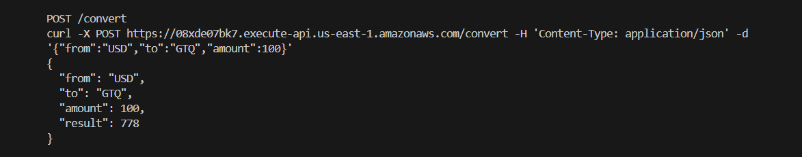

# oyd-exercise-3-2 — Lambda Currency Converter

Terraform module that provisions a Node.js Lambda function backed by an API Gateway HTTP API, implementing a minimal currency converter.

## Prerequisites

- AWS credentials configured (`aws sts get-caller-identity` must succeed)
- Terraform CLI >= 1.8
- Node.js installed (to generate the deployment zip)

## Repository structure

```
oyd-exercise-3-2/
  app/
    index.js           # Lambda handler
  infra/
    provider.tf
    variables.tf
    outputs.tf
    main.tf
    envs/dev/dev.tfvars
    modules/
      compute_lambda/
        main.tf
        variables.tf
        outputs.tf
    evidence/
      function.txt
  .github/
    workflows/
      terraform-ci.yml
  .gitignore
  README.md
```

## Deploy

```bash
# 1. Build the deployment zip
cd app/
zip function.zip index.js
cd ..

# 2. Initialize and apply
cd infra/
terraform init
terraform plan -var-file=envs/dev/dev.tfvars
terraform apply -var-file=envs/dev/dev.tfvars
```

## Test

```bash
INVOKE_URL=$(cd infra && terraform output -raw invoke_url)

curl ${INVOKE_URL}/rates
# {"rates":{"USD":1,"EUR":0.92,"GBP":0.79,"JPY":149.5,"GTQ":7.78}}

curl -X POST ${INVOKE_URL}/convert \
  -H 'Content-Type: application/json' \
  -d '{"from":"USD","to":"GTQ","amount":100}'
# {"from":"USD","to":"GTQ","amount":100,"result":778}
```

## Destroy

```bash
cd infra/
terraform destroy -var-file=envs/dev/dev.tfvars
```

## Evidence

`infra/evidence/function.txt` — output of `aws lambda get-function` after apply:

```json
{
    "FunctionArn": "arn:aws:lambda:us-east-1:203036352580:function:currency-converter-dev",
    "State": "Active",
    "Arch": [
        "arm64"
    ]
}
```

### Endpoint responses

**GET /rates**

```
curl https://i8yb23jceb.execute-api.us-east-1.amazonaws.com/rates
{"rates":{"USD":1,"EUR":0.92,"GBP":0.79,"JPY":149.5,"GTQ":7.78}}
```

**POST /convert**

```
curl -X POST https://i8yb23jceb.execute-api.us-east-1.amazonaws.com/convert \
  -H 'Content-Type: application/json' \
  -d '{"from":"USD","to":"GTQ","amount":100}'
{"from":"USD","to":"GTQ","amount":100,"result":778}
```

### Console screenshot


